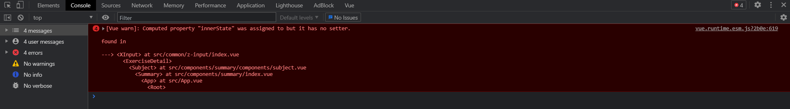
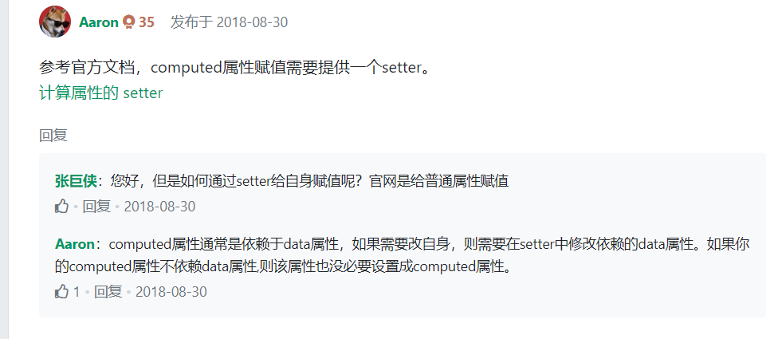
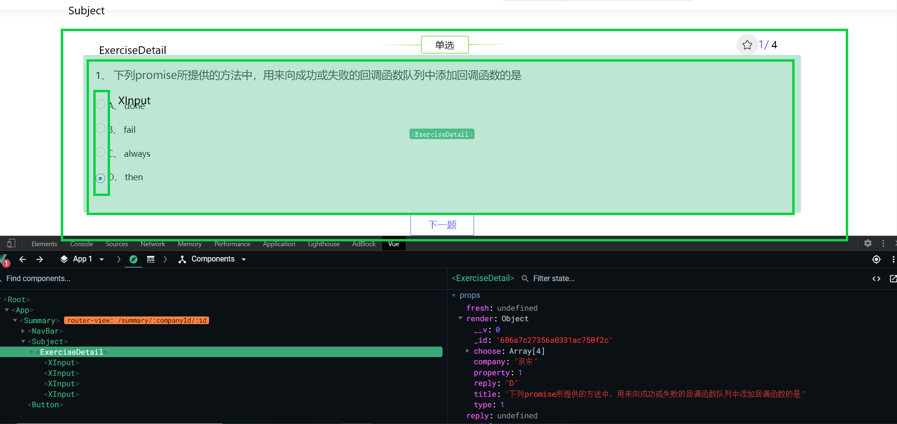

### 环境搭建
### 环境部署
- `yarn`安装环境依赖项
- `yarn dev`进入开发模式
- `yarn build`打包部署

### 功能相关
#### 1.用户提交答案
用户提交答案的id由登录时存储并在提交答案页面获取。用户点击下一题的时候，需要将用户信息本地缓存，防止用户信息丢失；当用户不小心将页面刷新时，可以通过调用回显接口。
#### 2.动态路由跳转
提醒一下，当使用路由参数时，例如从 /user/foo 导航到 /user/bar，原来的组件实例会被复用。因为两个路由都渲染同个组件，比起销毁再创建，复用则显得更加高效。不过，这也意味着组件的生命周期钩子不会再被调用。复用组件为`Summary`
#### 你可以简单地 watch (监测变化) $route 对象
```javascript
const User = {
  template: '...',
  watch: {
    $route(to, from) {
      // 对路由变化作出响应...
    }
  }
}
```
#### 或者使用 2.2 中引入的 beforeRouteUpdate 导航守卫：
`@/components/summary/index.vue`
```javascript
  beforeRouteUpdate(to, from, next) {
    this.renderData(to.params.id, 2)
    next();
  },
```

#### 3. @include @mixin 等引入
`@/common/z-input/index.vue`
```scss
      $success: #586AEA;
    $warning: #ffcc00;
    $error: #cc3300;

    @mixin map-radio($color) {
        display: flex;
            justify-content: center;
            align-items: center;
            border: 1px solid $color;

            .pitch {
                display: inline-block;
                width: 6px;
                height: 6px;
                border-radius: 50%;
                background: $color;
                text-align: center;
            }
    }

    .success.radio {
            @include map-radio($success)
        }
        .warning.radio {
            @include map-radio( $warning)
        }
        .error.radio {
            @include map-radio($error)
        }
```
### 项目设计思路分析
#### `main.js`:
- 该脚本
+ 1.  通过原型拓展Vue构造函数的功能：`axios`封装`./utils/request`，
+ 2. 引入vue全家桶vue-router、vuex作为new Vue()的参数，vue实例化（▶*实例化内部vue做了什么事情*）后将编译成render函数[将vue-router匹配的首页组件`home/index.vue`编译成render函数，然后挂载在引入的App.vue中的id为app的element中](#render内部渲染)。
+ 3. `import`引入`element`,Vue.use(element)❓使用element-ui组件, import 引入公共scss样式，[import 引入`./permission.js`](#`permission.js`)（▶**vue组件全局路由钩子**）❓引入的机制和在vue内部的实现如何拓展vue实例功能。

#### render内部渲染
#### `permission.js`
  `permission.js`定义了全局路由钩子。通过工具函数获取存储在本地cookie中的token;当存在token后，访问登录页，直接重定向`path:/`,访问别的页面直接放行。当不存在token时，如果要访问的路径不在白名单中，重定向到登录页;存在白名单中时，直接放行。
  ```javascript
  import router from './router/index.js';
  // import store from './store/index.js';
  import tokenInstance from './utils/auth.js';  // 从cookie获取token

  const whiteList = ['/login', '/', '/sign', '/register'];   // 路由白名单

  router.beforeEach((to, from, next) => { 
    const hasToken = tokenInstance.getToken();
   
    if(hasToken) {
      if(to.path == '/login') {
        next({ path: '/' })
      } else {
        next();  
      }
    } else {
      whiteList.indexOf(to.path) !== -1 ? next() : next({ path: '/login'})
    }
  })
  ```

### 项目中涉及到技术分析
#### 试图修改子组件中计算属性的值
##### 父组件
```javascript
 /**
 * 清空选中效果
 */
clearSelect() {
  this.render.choose.forEach((item,index) => {
      let target = this.$refs['xInput' + index][0];
      target.innerState = ""
    })
}
```
#### 子组件
```JavaScript
computed: {
    innerState() {
        console.log(this.value, this.reply, 'hi')
        if(this.value === this.reply) {
            return 'success'
        } 
    }
}
```
#### 报错:

#### 解决方案

因为本人的**computed**不依赖**data**属性，所以❓<span style="border-bottom: 1px solid">即便设置set估计也不会响应式触发</span>所以暂时弃用computed，使用**methods**。嗯~🤔有些牵强，毕竟computed也是依赖props属性的，props也是响应式属性呢。但是props规范并不支持被修改呢。
### **连续组件传值**

组件传值的时候，父组件定义的初始值和经过ajax或者别的方式更改的值都会传入到子组件中。如果子组件将接收到的props值非直接渲染，而是通过将props值赋值给data中的属性值的话，那么将会出现无法渲染数据的问题。❓<span style="border-bottom: 1px solid ">原因在于经过data、props的属性初始化一次，并不会监听传入的值的变化</span>你会问了，为什么直接在`<template></template>`模板能够动态监听到props的变化，并渲染呢。原因嘛：<span style="border-bottom: 1px solid ">😂等后面需要的时候在去研究</span>。言归正传：解决方案就是使用watch监听props值的变化喽。
### **将props值保存到本地**
所有的 prop 都使得其父子 prop 之间形成了一个单向下行绑定：父级 prop 的更新会向下流动到子组件中，但是反过来则不行。这样会防止从子组件意外变更父级组件的状态，从而导致你的应用的数据流向难以理解。

额外的，每次父级组件发生变更时，子组件中所有的 prop 都将会刷新为最新的值。这意味着你不应该在一个子组件内部改变 prop。如果你这样做了，Vue 会在浏览器的控制台中发出警告。

这里有两种常见的试图变更一个 prop 的情形：
1. **这个 prop 用来传递一个初始值；这个子组件接下来希望将其作为一个本地的 prop 数据来使用**。在这种情况下，最好定义一个本地的 data property 并将这个 prop 用作其初始值：
```javascript
props: ['initialCounter'],
data: function () {
  return {
    counter: this.initialCounter
  }
}
```
2. **这个 prop 以一种原始的值传入且需要进行转换**。在这种情况下，最好使用这个 prop 的值来定义一个计算属性：
```javascript
props: ['size'],
computed: {
  normalizedSize: function () {
    return this.size.trim().toLowerCase()
  }
}
```
>>> 注意在 JavaScript 中对象和数组是通过引用传入的，所以对于一个数组或对象类型的 prop 来说，在子组件中改变变更这个对象或数组本身将会影响到父组件的状态。