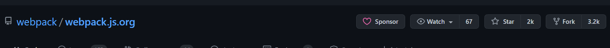
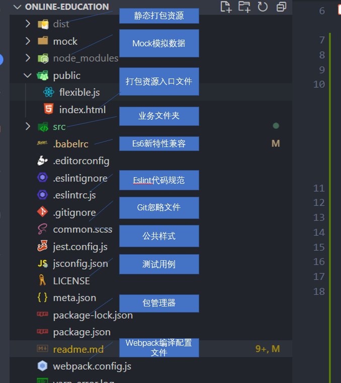
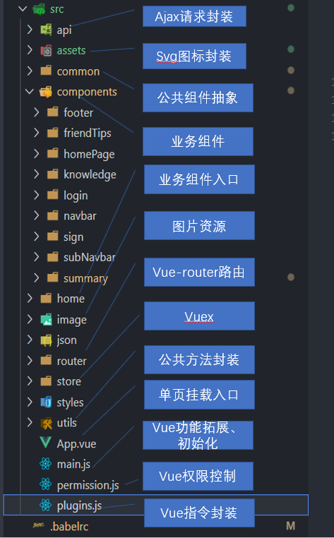
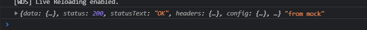
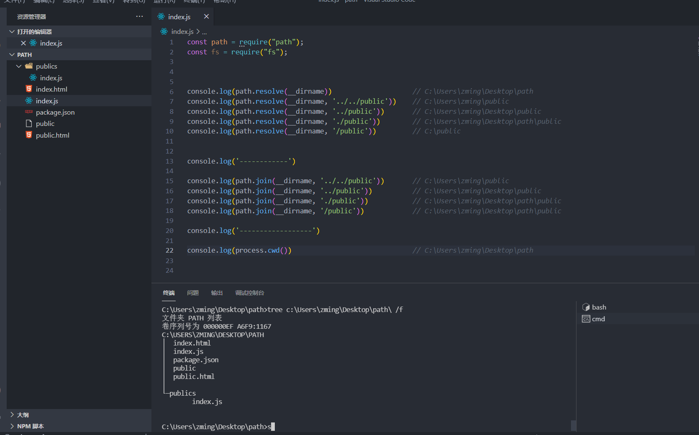
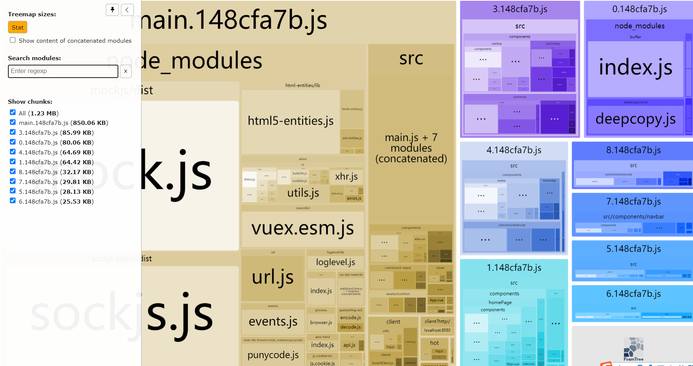
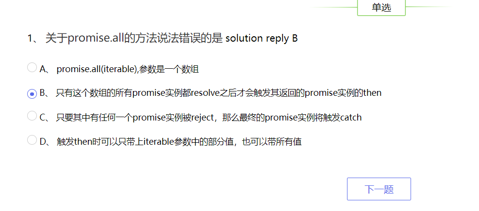
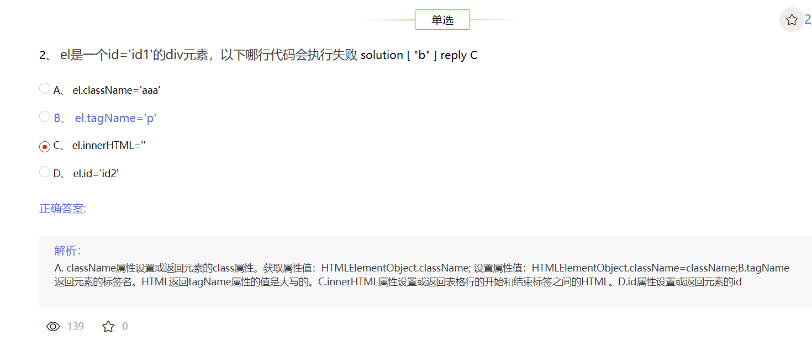
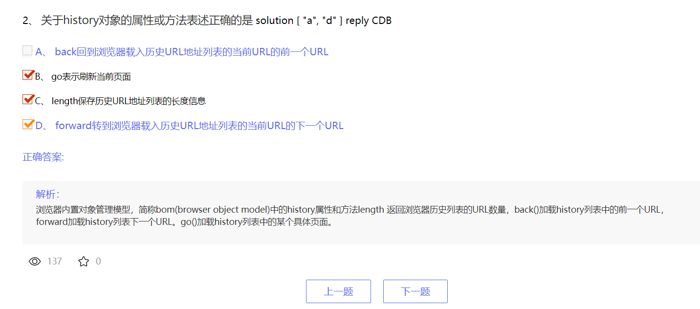

### 环境搭建
### 环境部署
- `yarn`安装环境依赖项
- `yarn dev`进入开发模式
- `yarn build`打包部署

## 基础搭建

1. 真的有点坑<br>
基础架构搭建使用的是开源库 [开源地址🤔](https://github.com/webpack/webpack.js.org.git), 当时看到star很多就选择了后面自己实际写业务模块的时候，发现坑真的多啊。最多的是因为该项目模板长期未更新，导致依赖模块的版本过低，依赖之间各个不兼容，甚至当时`webpack`是3.0的。通过大量的`github issue`查找，谷歌英文搜索，逐渐的完善了下来。

----
2. 踩坑中学习<br>
2.1 项目架构分析
<br>
-----
<br>
2.2 **MOCK**
* (1)在`main.js`中引入`mock`: 

```javascript
import '../mock';
```
* (2)配置`mock`信息
```javascript
import Mock from 'mockjs';

// 通过Mock.mock()模拟api接口
Mock.mock('/api/goodslist', 'get', {
    status: 200,
    message: '获取数据列表成功',
    'data|5-10': [
        {
            // 'id|+1': 0, //模拟自增长的id
            id: '@increment(1)',
            name: '@cword(2,5)',
            price: '@natural(2,10)',
            count: '@natural(100,999)',
            img: '@dataImage(25x25)'
        }
    ]
});
```
* (3) 使用`axios`本地请求`mock`数据

`axios`的`baserURl`需要为`/`,然后正常的请求为
```javascript
this.$ajax({
      url: '/api/goodslist',
      method: 'get',
    })
    .then(data => {
      console.log(data, 'from mock')
    })
```
结果<br><br>

2.3 **webpack**
* (1) `Node.js`核心模块之`path`<br>
  `path.__dirname`指当前文件所在目录的绝对地址。
  `path.resolve()`和`path.join()`的区别
  
* (2) `HtmlWebpackPlugin`插件<br>
  `webpack`入口文件`entry`为`main.js`,打包资源路径设置为和webpack.config.js同级下的dist文件，**将publicPath设置为''**能够保证静态资源部署在服务器的时候，已合适的方式找到资源地址。否则会出现地址路径不匹配的情况。<br>
  通过`HtmlWebpackPlugin`插件可以自动的将打包后的静态资源注入到已经写好的`index.html`文件中。这样就成为了最初的`index.html`引入`head`、`link`、`body`、`script`的方式。通过file的方式是打开是不完整的，需要使用`node.js`的静态资源加载的方式，获取静态资源。即`app.use('/', express.static(path.resolve(__dirname, './dist')))`的方式了。<br>
* (3) `BundleAnalyzerPlugin`插件<br>
  该插件主要用于分析打包完成后静态资源`size`情况。<br>
  <br>
  配置如下<br>
  ```javascript
    plugins: [
    new VueLoaderPlugin(),
    new HtmlWebpackPlugin({
      template: path.resolve(__dirname, './public/index.html')
    }),

    new BundleAnalyzerPlugin({
      analyzerHost: '127.0.0.1',
      analyzerPort: '7000'
    })
  ],
  ```
  目前的感觉就是，让各个模块的`size`均衡分布，比如大的模块要需要尽量拆分出来，比如之前的`element-ui`和`vue`模块，引入之后的打包资源非常大，我的1G2核的服务器在初次加载的时候，耗时很长才能加载页面出来。于是我查阅资料，阅读webpack文档后，引入了`externals`;
* (4) `externals`配置(打包资源优化)<br>
防止将某些 import 的包(package)打包到 bundle 中，而是在运行时(runtime)再去从外部获取这些扩展依赖(external dependencies)。这样打包后的资源就缩小了很多，在优化方面，尽量不要因为某个功能就去引入一整个包，如果需要这个功能的话，就去研究这个`npm`包的代码出来，然后扣出你所需要的功能，直接使用在项目中。当然很多huawei员工也这样干的，不过需要 MIT协议了。这也就是为啥需要理解`prototype`原型链、`this`指向、执行上下文这些的原因了，理解了，帮助你更好的吸收源代码，然后魔改一番到自己的项目中啦<br>
所以`index.html`静态资源就出现了cdn的引入链接
```html
<body>
      <!-- import Vue before Element -->
      <script src="https://unpkg.com/vue/dist/vue.js"></script>
      <!-- import JavaScript -->
      <script src="https://unpkg.com/element-ui/lib/index.js"></script>

      <script>
        let metaEl = document.querySelector('meta[name="viewport"]');
        let dpr = window.devicePixelRatio;
        let scale = 1 / dpr;

        metaEl.setAttribute('content', 'width=device-width, initial-scale=' + scale + ', maximum-scale=' + scale + ', minimum-scale=' + scale + ', user-scalable=yes');  
          

      </script>
  
      <div id="app"></div>
</body>
```
`exernals`配置如下<br>
```javascript
  externals: {
    vue: 'Vue',
    'element-ui':'ELEMENT'
  },
```
* (5) `Loaders`管理资源<br>

当我们混入一些资源如图片、字体、样式等等,可借助webpack通过 loader 或内置的 Asset Modules 引入任何其他类型的文件。webpack 根据正则表达式，来确定应该查找哪些文件，并将其提供给指定的 loader。
```javascript
module: {
    rules: [
      {
        test: /\.css$/,
        use: [
          'vue-style-loader',
          'css-loader'
        ],
      },
      {
        test: /\.scss$/,
        use: [
          'vue-style-loader',
          'css-loader',
          'sass-loader'
        ],
      },
      {
        test: /\.sass$/,
        use: [
          'vue-style-loader',
          'css-loader',
          'sass-loader?indentedSyntax'
        ],
      },
      {
        test: /\.vue$/,
        loader: 'vue-loader',
        options: {
          loaders: {
            'scss': [
              'vue-style-loader',
              'css-loader',
              'sass-loader'
            ],
            'sass': [
              'vue-style-loader',
              'css-loader',
              'sass-loader?indentedSyntax'
            ]
          }
        }
      },
      {
        test: /\.js$/,
        loader: 'eslint-loader',
        enforce: "pre",
        include: [path.resolve(__dirname, 'src')],//指定检查的目录
        options: {
          formatter: require('eslint-friendly-formatter') // 指定错误报告的格式规范
        },
        exclude: /node_modules/ 
      },

      {
        test: /\.(png|jpg|gif|svg)$/,
        loader: 'file-loader',
        options: {
          name: '[name].[ext]?[hash]'
        }
      },
      {
        test: /\.(ttf|eot|svg|woff|woff2)$/,
        loader: 'url-loader'
      },
    ]
  },

```

* (6) 配置`webpack-dev-server`进行热更新<br>
配置如下：<br>
```javascript
 devServer: {
    contentBase: './dist',
  },
```
`package.json`脚本为
```javascript
 "dev": "cross-env NODE_ENV=development webpack-dev-server --open --hot",
```
>>> 配置告知 `webpack-dev-server`，将 `dist` 目录下的文件 `serve` 到 `localhost:8080` 下。（serve，将资源作为 server 的可访问文件）

>>>`webpack-dev-server` 会从 `output.path` 中定义的目录为服务提供 `bundle` 文件，即，文件将可以通过 `http://[devServer.host]:[devServer.port]/[output.publicPath]/[output.filename]` 进行访问。

>>> webpack-dev-server 在编译之后不会写入到任何输出文件。而是将 bundle 文件保留在内存中，然后将它们 serve 到 server 中，就好像它们是挂载在 server 根路径上的真实文件一样。如果你的页面希望在其他不同路径中找到 bundle 文件，则可以通过 dev server 配置中的 publicPath 选项进行修改。


3. 向优秀学习<br>
像俺们公司的目前基础架构采用的是`vue-cli3`，然后在`vue.config.js`中使用`chainWebpack`,然后引入`webpack.dev.js`和 `webpack.pro.js`两种环境模块。当然了，两者开发模块间还有公共部分，于是乎又出现了`webpack.common.js`模块供`dev`和`pro`环境使用。然后针对前端本地代理的服务器`proxy`继续抽象，让代理服务器地址、端口等配置信息单独抽离，作为`json`。`json`作为webpack原生支持的模块，根本不用使用`module.exports`,直接导入导出。然后就是在针对webpack的一通操作了：`loader`、`plugins`、`performance`等等。

----------

3. 


## 模块构建

## 业务方向

## 性能优化


## 打包部署


### 功能相关
#### 1.用户提交答案
用户提交答案的id由登录时存储并在提交答案页面获取。用户点击下一题的时候，需要将用户信息本地缓存，防止用户信息丢失；当用户不小心将页面刷新时，可以通过调用回显接口。
#### 2.动态路由跳转
提醒一下，当使用路由参数时，例如从 /user/foo 导航到 /user/bar，原来的组件实例会被复用。因为两个路由都渲染同个组件，比起销毁再创建，复用则显得更加高效。不过，这也意味着组件的生命周期钩子不会再被调用。复用组件为`Summary`
#### 你可以简单地 watch (监测变化) $route 对象
```javascript
const User = {
  template: '...',
  watch: {
    $route(to, from) {
      // 对路由变化作出响应...
    }
  }
}
```
#### 或者使用 2.2 中引入的 beforeRouteUpdate 导航守卫：
`@/components/summary/index.vue`
```javascript
  beforeRouteUpdate(to, from, next) {
    this.renderData(to.params.id, 2)
    next();
  },
```

#### 3. @include @mixin 等引入
`@/common/z-input/index.vue`
```scss
      $success: #586AEA;
    $warning: #ffcc00;
    $error: #cc3300;

    @mixin map-radio($color) {
        display: flex;
            justify-content: center;
            align-items: center;
            border: 1px solid $color;

            .pitch {
                display: inline-block;
                width: 6px;
                height: 6px;
                border-radius: 50%;
                background: $color;
                text-align: center;
            }
    }

    .success.radio {
            @include map-radio($success)
        }
        .warning.radio {
            @include map-radio( $warning)
        }
        .error.radio {
            @include map-radio($error)
        }
```
### 项目设计思路分析
#### `main.js`:
- 该脚本
+ 1.  通过原型拓展Vue构造函数的功能：`axios`封装`./utils/request`，
+ 2. 引入vue全家桶vue-router、vuex作为new Vue()的参数，vue实例化（▶*实例化内部vue做了什么事情*）后将编译成render函数[将vue-router匹配的首页组件`home/index.vue`编译成render函数，然后挂载在引入的App.vue中的id为app的element中](#render内部渲染)。
+ 3. `import`引入`element`,Vue.use(element)❓使用element-ui组件, import 引入公共scss样式，[import 引入`./permission.js`](#`permission.js`)（▶**vue组件全局路由钩子**）❓引入的机制和在vue内部的实现如何拓展vue实例功能。

#### render内部渲染
#### `permission.js`
  `permission.js`定义了全局路由钩子。通过工具函数获取存储在本地cookie中的token;当存在token后，访问登录页，直接重定向`path:/`,访问别的页面直接放行。当不存在token时，如果要访问的路径不在白名单中，重定向到登录页;存在白名单中时，直接放行。
  ```javascript
  import router from './router/index.js';
  // import store from './store/index.js';
  import tokenInstance from './utils/auth.js';  // 从cookie获取token

  const whiteList = ['/login', '/', '/sign', '/register'];   // 路由白名单

  router.beforeEach((to, from, next) => { 
    const hasToken = tokenInstance.getToken();
   
    if(hasToken) {
      if(to.path == '/login') {
        next({ path: '/' })
      } else {
        next();  
      }
    } else {
      whiteList.indexOf(to.path) !== -1 ? next() : next({ path: '/login'})
    }
  })
  ```

### 项目中涉及到技术分析
#### 试图修改子组件中计算属性的值
##### 父组件
```javascript
 /**
 * 清空选中效果
 */
clearSelect() {
  this.render.choose.forEach((item,index) => {
      let target = this.$refs['xInput' + index][0];
      target.innerState = ""
    })
}
```
#### 子组件
```JavaScript
computed: {
    innerState() {
        console.log(this.value, this.reply, 'hi')
        if(this.value === this.reply) {
            return 'success'
        } 
    }
}
```
#### 报错:

#### 解决方案

因为本人的**computed**不依赖**data**属性，所以❓<span style="border-bottom: 1px solid">即便设置set估计也不会响应式触发</span>所以暂时弃用computed，使用**methods**。嗯~🤔有些牵强，毕竟computed也是依赖props属性的，props也是响应式属性呢。但是props规范并不支持被修改呢。
### **连续组件传值**

组件传值的时候，父组件定义的初始值和经过ajax或者别的方式更改的值都会传入到子组件中。如果子组件将接收到的props值非直接渲染，而是通过将props值赋值给data中的属性值的话，那么将会出现无法渲染数据的问题。❓<span style="border-bottom: 1px solid ">原因在于经过data、props的属性初始化一次，并不会监听传入的值的变化</span>你会问了，为什么直接在`<template></template>`模板能够动态监听到props的变化，并渲染呢。原因嘛：<span style="border-bottom: 1px solid ">😂等后面需要的时候在去研究</span>。言归正传：解决方案就是使用watch监听props值的变化喽。
### **将props值保存到本地**
所有的 prop 都使得其父子 prop 之间形成了一个单向下行绑定：父级 prop 的更新会向下流动到子组件中，但是反过来则不行。这样会防止从子组件意外变更父级组件的状态，从而导致你的应用的数据流向难以理解。

额外的，每次父级组件发生变更时，子组件中所有的 prop 都将会刷新为最新的值。这意味着你不应该在一个子组件内部改变 prop。如果你这样做了，Vue 会在浏览器的控制台中发出警告。

这里有两种常见的试图变更一个 prop 的情形：
1. **这个 prop 用来传递一个初始值；这个子组件接下来希望将其作为一个本地的 prop 数据来使用**。在这种情况下，最好定义一个本地的 data property 并将这个 prop 用作其初始值：
```javascript
props: ['initialCounter'],
data: function () {
  return {
    counter: this.initialCounter
  }
}
```
2. **这个 prop 以一种原始的值传入且需要进行转换**。在这种情况下，最好使用这个 prop 的值来定义一个计算属性：
```javascript
props: ['size'],
computed: {
  normalizedSize: function () {
    return this.size.trim().toLowerCase()
  }
}
```
>>> 注意在 JavaScript 中对象和数组是通过引用传入的，所以对于一个数组或对象类型的 prop 来说，在子组件中改变变更这个对象或数组本身将会影响到父组件的状态。
### 对题目选项做出选择 && 刷新或者跳转路由切换时，选择项回显 && 题目答案判断
> 效果展示
<br>
选中效果

题目判断



#### 逻辑说明
抽离为三个参数：solutions[Array](答案) replys(用户选择) "string collection" value: "string"(x-input组件的value值)。当选中时，将用户选择项和value对比，符合就在computed返回"success"class类；当用户点击交卷时，请求带有答案的接口，然后replys和solutions比较：1.完全相等2. 不相等 2.1 部分匹配 2.2 部分不匹配 2.3 完全不匹配；然后匹配出的数组matchList和value对比即可。